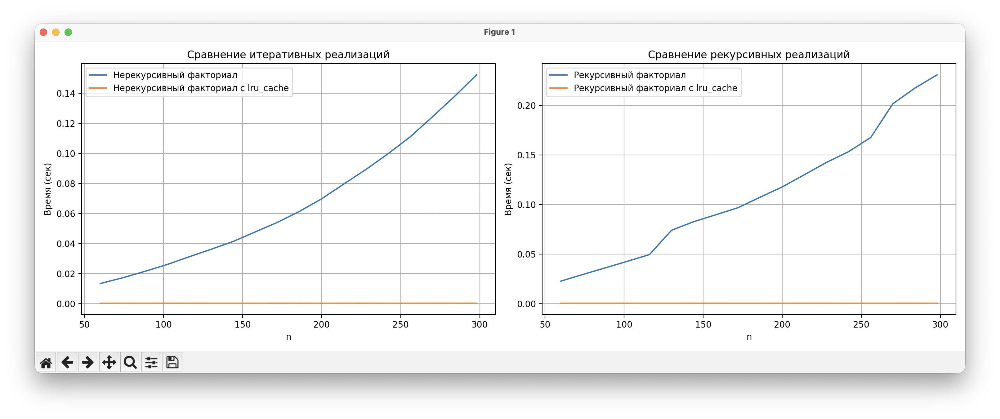

# Лабораторные работы Питон
Лабораторные идут по списку:
lr1 - первая, lr2 - вторая и тд
# Автор
Ахметов Артём P3122 504980
## lr1
В первой лабораторной реализовано задание "Сумма двух", здесь 2 основных файла: lr1.py - основная функция, с решением задания, testLr1.py - тест функции на ошибки
## lr2
Во второй лабораторной реализована игра 'Угадай число', здесь 2 основных файла: lr2.py - основная функция, с решением задания, testLr2.py - тест функции на ошибки
## lr3
В третьей лабораторной реализована функция Бинарное дерево, здесь 2 основных файла: lr3.py - основная функция, с решением задания, testLr3.py - тест функции на ошибки
## lr4
Результаты benchmark:

## lr3
В пятой лабораторной реализована функция Бинарное дерево (нерекурсивно), здесь 2 основных файла: lr5.py - основная функция, с решением задания, testLr5.py - тест функции на ошибки