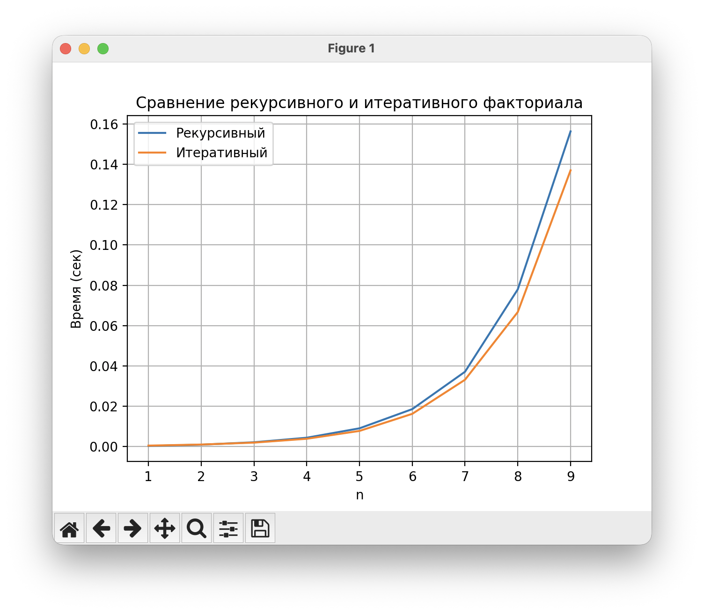

# Лабораторные работы Питон
Лабораторные идут по списку:
lr1 - первая, lr2 - вторая и тд
# Автор
Ахметов Артём P3122 504980
## lr1
В первой лабораторной реализовано задание 'Сумма двух', здесь 2 основных файла: lr1.py - основная функция, с решением задания, testLr1.py - тест функции на ошибки
## lr2
Во второй лабораторной реализована игра 'Угадай число', здесь 2 основных файла: lr2.py - основная функция, с решением задания, testLr2.py - тест функции на ошибки
## lr3
В третьей лабораторной реализована функция 'Бинарное дерево', здесь 2 основных файла: lr3.py - основная функция, с решением задания, testLr3.py - тест функции на ошибки
## lr4
Результаты benchmark:

## lr5
В пятой лабораторной реализована функция 'Бинарное дерево' (нерекурсивно), здесь 2 основных файла: lr5.py - основная функция, с решением задания, testLr5.py - тест функции на ошибки
## lr6
В шестой лабораторной реализован бенчмарк с проверкой функций 'Бинарного дерева' (рекурсивно и нерекурсивно), здесь 2 основных файла: lr6.py - основная функция, с решением задания, bmLr6.png - результат бенчмарка

## lr7
В седьмой лабораторной представлен результат работы с API, логгированием, декораторами и тестами. Основная информация о работе представлена в отчете (readme.md). lr7.py - основной файл с реализацией, testLr7.py - тесты, currency.log - логи мною созданного декоратора (создается автоматически), quadratic.log - пример использование логов (создается автоматически). Также создано виртуальное окружение
## lr8
В восьмой лабораторной реализовано клиент-сервер приложение. Основная информация представлена в readme.md в папке lr8.